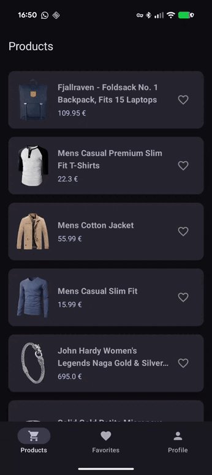

# FakeApp - Android Technical Challenge 🥭

This project is a modern Android application built for a technical assessment. It demonstrates a solid understanding of **Clean Architecture**, **Modularization**, and **Reactive Programming** using the latest Android development standards.

## 🚀 Features

- **Product Listing**: Fetch and display products from the [FakeStoreAPI](https://fakestoreapi.com).
- **Local Persistence**: Add/remove products from favorites using **Room**.
- **Real-time Sync**: Changes in the favorites screen are reflected instantly in the product list using reactive streams.
- **User Profile**: Displays user details and a dynamic counter of favorite items.

## 🏗️ Architecture

The project follows a **Modular Clean Architecture** approach to ensure scalability, maintainability, and testability.

### Modules:
- **`:domain`**: Pure Kotlin module containing Business Logic, Models, Repository Interfaces, and Use Cases. (Zero dependencies on Android).
- **`:data`**: Implementation of repositories, Networking (Retrofit), and Local Database (Room).
- **`:app`**: UI layer built with **Jetpack Compose**, following the **MVVM** pattern.

### Key Patterns:
- **Use Cases**: Isolated business logic components to decouple ViewModels from Repositories.
- **Single Source of Truth (SSOT)**: The database acts as the master state for favorites, synchronized with API data in the domain layer.
- **Dependency Injection**: Powered by **Koin 4.0** using modern constructor injection (`singleOf`, `viewModelOf`).

## 🛠️ Tech Stack

- **UI**: Jetpack Compose with Material 3.
- **Navigation**: Compose Navigation.
- **Image Loading**: Coil.
- **Networking**: Retrofit 2 + OkHttp + Gson.
- **Local DB**: Room Persistence Library.
- **Async**: Kotlin Coroutines & Flow (Reactive streams).
- **DI**: Koin.
- **Processing**: KSP (Kotlin Symbol Processing).

## 🧪 Testing

The project prioritizes quality with a comprehensive test suite:

- **Unit Tests (24)**: 
  - **Mappers**: Verifying DTO-to-Domain and Entity-to-Domain transformations.
  - **Repositories**: Mocked networking and database interactions.
  - **Use Cases**: Testing reactive logic and data combination using **Turbine**.
  - **ViewModels**: Verifying UI state transitions (Loading -> Success/Error).
  - **DI**: Verification of Koin modules integrity.
- **Instrumented Tests (4)**:
  - Automated UI tests for navigation and screen content verification.

**Tools used**: JUnit 4, MockK, Turbine, Coroutines Test, Koin Test.

## 📸 Demo

---
Developed by **Jose Casado**
